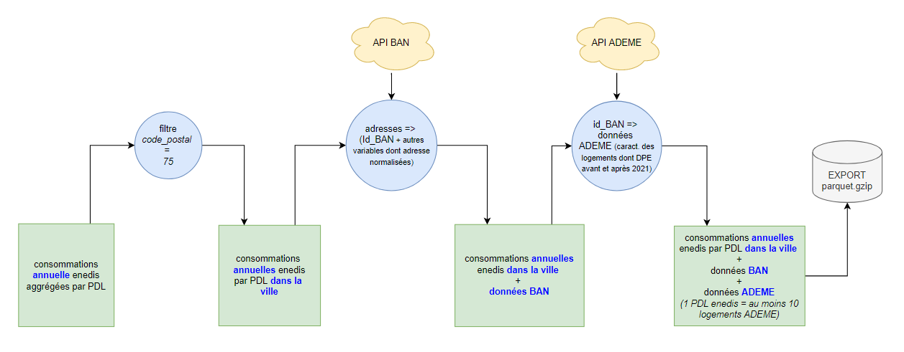
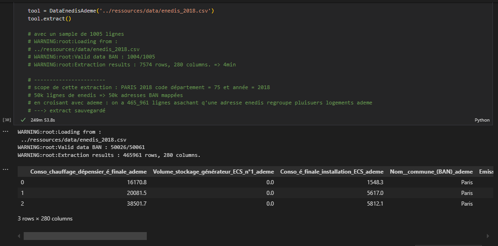

### Opendata University Challenge DPE

Last update : 21/01/2025

#### Documentation du projet 
- Problématique, objectifs, livrables etc.. *(déjà fait - à compléter)*
- Source : [Opendata university challenge DPE (defis data gouv)](https://defis.data.gouv.fr/defis/diagnostics-de-performance-energetique).

#### Données
- Périmètre : PARIS 2018 
- Source du dataset : Worflow data (données croisées) issues :
    * des [consommations d'électricité d'ENEDIS](https://data.enedis.fr/explore/dataset/consommation-annuelle-residentielle-par-adresse/information/)
    * de l'API de la Base Nationale des Adresses ([BAN](https://guides.data.gouv.fr/reutiliser-des-donnees/utiliser-les-api-geographiques/utiliser-lapi-adresse/rappel-donnees-adresses))
    * de la base des [DPE de l'ADEME](https://data.ademe.fr/datasets/dpe-v2-logements-existants)
- Descriptif du workflow d'extraction <br><br>
    
    <br><br>
- Résultats des extracts du workflow par exploitation des API : exemples [ici](ressources/data/)

#### Installation du projet (en local)

For this project you can make a virtual env if needed. 

- After cloning, in your favorite terminal/shell do :
```
pip install -r requirements.txt
```
- For fetching data :
 * See [this exemple notebook](notebooks/1_database.ipynb) for code.
 * Data extraction perf exemple - mode unitaire depuis le notebook cité ci-dessus : <br><br>
 

- For launching streamlit analytic app and models, run : 
```
streamlit run app/main.py
```
(TBD : aperçu)

- There is also a docker container available (here)


#### Perspectives : 
- Généraliser périmètre géographique France
- Optimiser la classe d'extraction : exple PARIS 2018 ~ 4H ~ 450k lignes au final
- *... (à compléter)*
