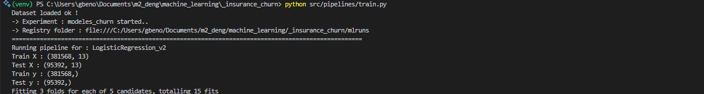
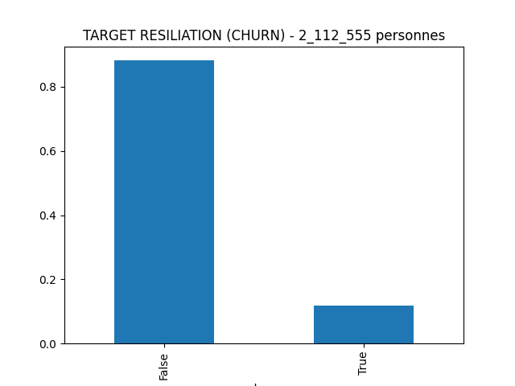
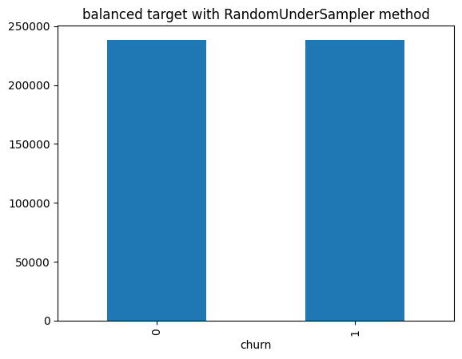
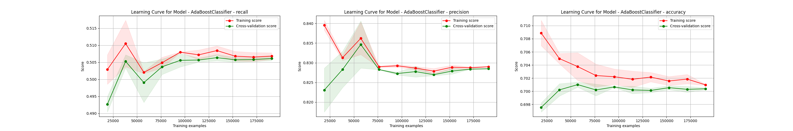
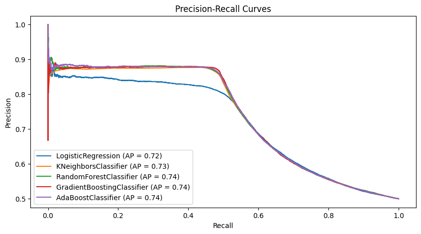

### Auto Insurance Churn Modelisation 
Last update : 15/03/2025

**Contexte**

Les compagnies d'assurance auto évoluent dans un environnement très concurrentiel et avec les diverses données collectées auprès de millions de clients, il est extrêmement difficile d'analyser et de comprendre les raisons qui poussent un client à changer de fournisseur d'assurance. Dans cette une industrie où l'acquisition et la fidélisation des clients sont tout aussi importantes, et où la première est un processus plus coûteux, les compagnies d'assurance s'appuient sur les données pour comprendre le comportement des clients afin de prévenir les résiliations. Ainsi, savoir à l'avance si un client est susceptible de changer de fournisseur permet aux compagnies d'assurance de mettre en place des stratégies pour éviter que cela ne se produise

*Ce projet utilise deu datasets différents. Un dataset issu d'une base de données simulé et un dataset autre avec des données réelles mais dont les variables sont nommées feature 1,2, 3... et où les données ont été transformées (transformation incoonue à priori).*

### Data simulée

- Source database relationnelle : https://www.kaggle.com/datasets/merishnasuwal/auto-insurance-churn-analysis-dataset/data?select=address.csv

Nous disposons initialement de 4 tables joignables avec des clées primaires/étrangères (ADDRESS_ID ou INDIVIDUAL_ID).

1. address.csv: contient les informations sur les addresses
2. customer.csv: contient les informations sur les clients (customer)
3. demographic.csv: contient des données demographiques
4. termination.csv: contient les données sur la fin des contrats

- *Info : Les addresses sont uniques mais plusieurs clients peuvent avoir les mêmes adresses et toutes les personnes n'ont pas leur informations démographiques disponibles (données manquantes)* 

Le dataset comporte plus de 2millions de clients et environs 1.5 millions d'adresses uniques. Avec le calcul de la variable target, on sait qu'environs 10% des personnes ont résilié leurs contrats.

- *Autre info des auteurs : Les données portent sur des clients d'une société d'assurance fictive localisée à **Dallas au Texas**.. donc les adresses sont fictives. Le dataset est utilisable pour la modélisation de la probabilité de résilisation et la logique sous-jacente utilisée pour la simulation de ce dataset s'aligne avec les études sur la prédiction de la résilisation dans le monde réel. **Donc on peut modéliser sur ce dataset et ré appliquer sur de vraies données.***


### Hackathon Data => real world data

- Source dataset : https://www.kaggle.com/datasets/k123vinod/insurance-churn-prediction-weekend-hackathon?resource=download

Nous disposons ici d'un dataset sur des features labelisées toujours sur le sujet de la modélisation. Ce dataset est basé sur des données réelles mais contient **les features sont renommées et transformées** dans le cadre d'un [!hackathon IA](https://www.machinehack.com/course/insurance-churn-prediction-weekend-hackathon-2/). L'objectif dudit hackathon était juste de construire un modèle de machine learning qui permettrait de prédire la probabilité de résiliation.

***Note sur état de l'art :*** *les participants du hackathon ne font pas de pré processing pour la plupart (juste un ré équilibrage) des données ce qui donne quand même des perfs de +de 90% d'accuracy et des F1-score de 60%) donc les données en l'état n'ont pas réellement besoin de feature engineering.*

### Objectif et challenge

Nous allons utiliser le premier dataset de données simulées pour construire un modèle et ensuite tenter de le généraliser sur les données réelles du hackathon.
- Challenge 1 : A priori, on sait que les modèles de machine learning généralisent mal donc on s'attend à des performances pas super à la fin.
- Challenge 2 : Le dataset simulé contient des millions d'observations dans des tables éparses. Il faut reconstituer la base et ensuite la nettoyer mais on aura un problème de dataviz.
- Challenge 3 : Il faudra trouver une manière d'établir la correspondance entre les features du dataset 1 et celles du daatset 2 car elles n'ont pas le même nom ni forcément le même range de valeurs mais juste les mêmes distributions statistiques. A priori c'est possible, mais il faut trouver la bonne technique.

### Utilisation de l'app (viz)
On commence par installer les requirements du projet : 
```
pip install -r requirements.txt
``` 

Pour visualiser les expériences réalisées avec mlflow depuis la racine (démarre sur le port 5000) par défaut :
```
mlflow ui #ou mlflow server
```

Avant de lancer l'application analytique streamlit, il faut lancer le serveur MLFlow (commande précédente)
```
streamlit run app/main.py
```

Enfin, les notebooks se trouvent dans le dossier `/notebooks` et regroupent les 3 étapes de ce travail de recherche : 

- la phase de reconstruction du dataset complet
- la phase d'exploration des données et de nettoyage
- la phase de modélisation et de selection de variables et de selection du/des meilleurs modèles.

### Utilisation de l'app (experiences ML)
Le fichier principal qui exécute les experiences de ML (chercher le meilleur modèle, tester des combinaisions d'encoders etc..) se trouve dans `src/pipelines/train.py`. Il se sert notamment de scripts qui sont dans `src/artifacts/` où on va retrouver soit des *encoders.py* customisés, soit la classe de nettoyage de la data *data_preprocessing.py* ou encore la classe principale qui éxécute l'expérience MLFlow *model.py*.

Pour lancer/reproduire une expérience après avoir changé (ou pas la config dans `src/pipelines/train.py`) il faut exécuter, dans l'environnement vrituel et à la racine du projet, la commande : 
```
python src/pipelines/train.py
```
*Exemple de run..*
<p align="center">
    
</p>


### Quelques images (rendu)
- Initialement la target est unbalanced : 
<p align="center">
    
</p>

- Balanced target (random under sampling): 
<p align="center">
    
</p>

- Learning curves (exple AdaboostClassifer)


- Precision recall curves on test set : 
<p align="center">
    
</p>
